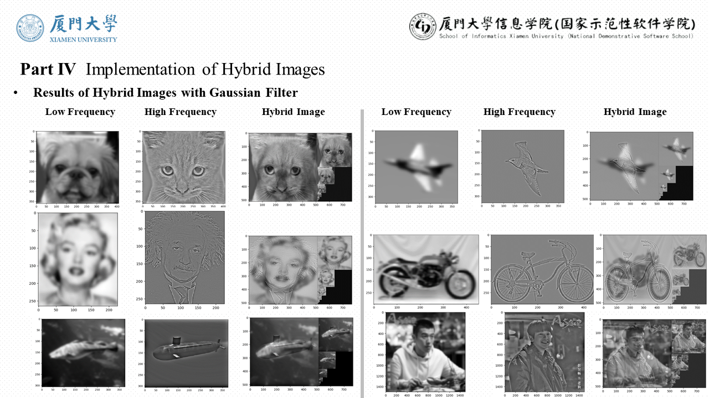
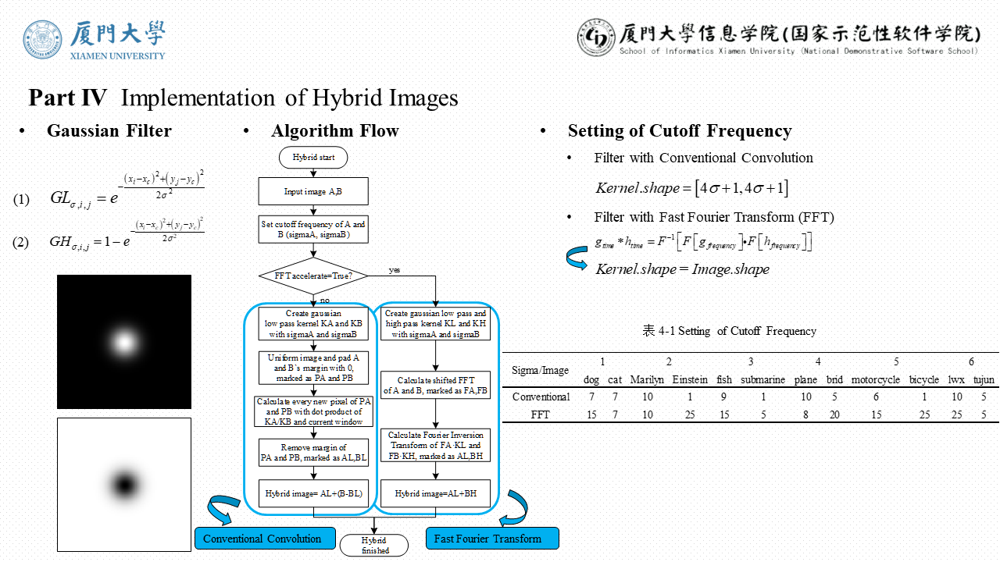

## Hybrid Images
This project is an implementation for Hybrid Images based on Gaussian low and high pass filter, coded in Python language.

We implement hybridizing of two images in two different ways, one is conventional convolution, the other is FFT accelerated convolution.

Here we represent 6 pair images to show the hybrid result.

## Project Structure
+ Runnable Python source files are [HybridImage_Gray.py](./HybridImage_Gray.py) and [HybridImage_RGB](./HybridImage_RGB.py), which are the implemented on Gray Scale and RGB Scale.
JUST CLONE THE REPOSITORY AND RUN IT!
+ Images to be hybridized are in [dataset_hybrid_images](./dataset_hybrid_images) directory, which contains 6 image pairs.
+ [hybrid_result_gray](./hybrid_result_gray) and [hybrid_result_rgb](./hybrid_result_rgb) directories are outputs of the two runnable Python scripts, which represent our result of hybrid images.

## Algorithm Process of Making Hybrid Image
+ Extract Low Pass Frequency
+ Extract High Pass Frequency
+ Combine Low Pass and High Pass Frequency

## Dependency

* [OpenCV 3.4.1](https://opencv.org/opencv-3-4-1/)

## References
* [1] Oliva, Aude & Torralba, Antonio & Schyns, Philippe. (2006). Hybrid images. ACM Trans. Graph.. 25. 527-532. 10.1145/1141911.1141919. 

## Author Info
LeoHao (XMU-CS)

## Date
2020.11.03

